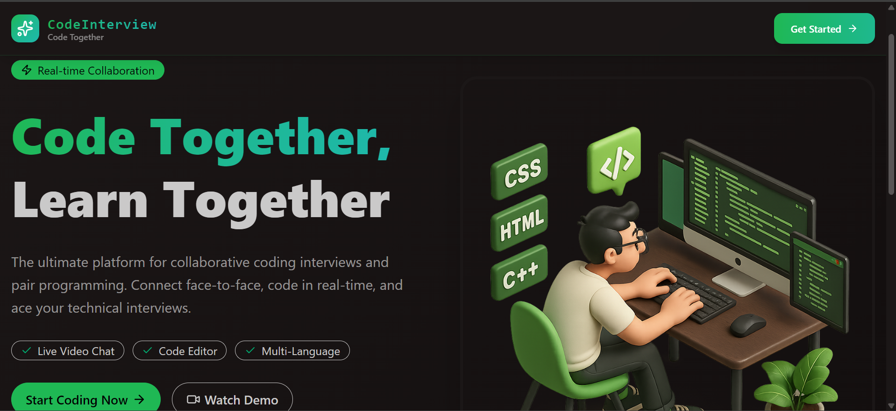

# ✨ CodeInterview — Full-Stack Coding Interview Platform ✨



A full-stack, real-time coding interview platform built for mock interviews, pair programming, and DSA practice.

---

## 🚀 Features

- 🧑‍💻 **VSCode-Powered Code Editor**
- 🔐 **Clerk Authentication**
- 🎥 **1-on-1 Video Interview Rooms**
- 🧭 **Dashboard with Live Statistics**
- 🔊 **Mic & Camera Toggle, Screen Sharing & Recording**
- 💬 **Real-Time Chat Messaging**
- ⚙️ **Secure Code Execution (Isolated Sandbox)**
- 🎯 **Auto Feedback — Testcase Based Success / Fail**
- 🎉 **Confetti on Success & Error Notifications**
- 🧩 **Practice Problems (Solo Coding Mode)**
- 🔒 **Room Locking — Allows Only 2 Participants**
- 🧠 **Background Jobs via Inngest**
- 🧰 **Node.js + Express REST API**
- ⚡ **TanStack Query for Optimized Data Fetching**
- 🤖 **CodeRabbit for PR Analysis**
- 🧑‍💻 **Git & GitHub Workflow (Branches, PRs, Merges)**
- 🚀 **Deployable on Sevalla (Free-Tier Friendly)**

---

## 🧪 Environment Setup

### ✅ Backend (`/backend/.env`)
```bash
PORT=3000
NODE_ENV=development

DB_URL=your_mongodb_connection_url

INNGEST_EVENT_KEY=your_inngest_event_key
INNGEST_SIGNING_KEY=your_inngest_signing_key

STREAM_API_KEY=your_stream_api_key
STREAM_API_SECRET=your_stream_api_secret

CLERK_PUBLISHABLE_KEY=your_clerk_publishable_key
CLERK_SECRET_KEY=your_clerk_secret_key

CLIENT_URL=http://localhost:5173
```

---

### ✅ Frontend (`/frontend/.env`)
```bash
VITE_CLERK_PUBLISHABLE_KEY=your_clerk_publishable_key

VITE_API_URL=http://localhost:3000/api

VITE_STREAM_API_KEY=your_stream_api_key
```

---

## 🔧 How to Run the Project 

### ✅ Start Backend
```bash
cd backend
npm install
npm run dev
```

### ✅ Start Frontend
```bash
cd frontend
npm install
npm run dev
```

➡️ Frontend: **http://localhost:5173**  
➡️ Backend: **http://localhost:3000**

---

## 📁 Folder Structure

```
CodeInterview/
 ├── backend/
 │   ├── src/
 │   ├── package.json
 │   └── .env
 ├── frontend/
 │   ├── src/
 │   ├── public/
 │   └── .env
 └── README.md
```

---

## 📜 License
This project is open-source and free to use for learning and portfolio purposes.

---
